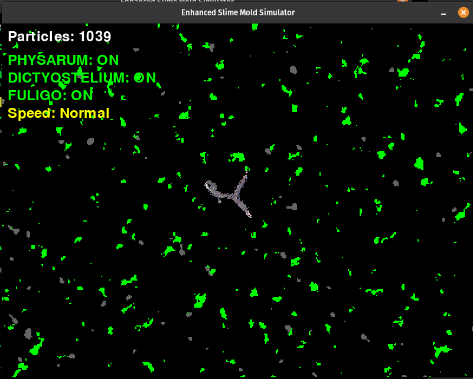

# Slime Mold Simulator

A highly realistic slime mold simulation that models the behavior of three different species of slime molds in a dynamic 2D environment. The simulator features realistic movement patterns, food seeking behavior, and environmental interactions.



## Features

- **Multiple Species**: Simulates three distinct slime mold species:
  - Physarum polycephalum
  - Dictyostelium discoideum
  - Fuligo septica

- **Realistic Behavior**:
  - Food seeking and consumption
  - Trail following and pheromone deposition
  - Environmental adaptation
  - Energy management and reproduction

- **Dynamic Environment**:
  - Temperature variations
  - Moisture levels
  - Obstacles
  - Food sources

- **Interactive Controls**:
  - Adjustable simulation speed
  - Species toggling
  - Debug mode
  - Food placement
  - Pause/Resume

## Requirements

- Python 3.8+
- Pygame 2.5.2
- NumPy 1.26.4
- noise 1.2.2

## Installation

1. Clone the repository:
```bash
git clone https://github.com/yourusername/slime-mold-simulator.git
cd slime-mold-simulator
```

2. Install dependencies:
```bash
pip install -r requirements.txt
```

## Usage

Run the simulator:
```bash
python enhanced_slime_mold.py
```

### Controls

- **Space**: Pause/Resume simulation
- **D**: Toggle debug mode
- **F**: Place food at mouse position
- **1, 2, 3**: Toggle species (1: Physarum, 2: Dictyostelium, 3: Fuligo)
- **R**: Reset simulation
- **S**: Cycle through speed settings (Normal → Fast → Supaslime)

### Debug Mode

Debug mode shows:
- Temperature map (red/blue gradient)
- Moisture map (blue overlay)
- Obstacles (gray)
- Food sources (green)

## Species Characteristics

### Physarum polycephalum
- Strong trail following
- Moderate speed
- Balanced moisture preference
- Prefers moderate temperatures

### Dictyostelium discoideum
- More exploratory
- Faster movement
- Higher moisture preference
- Prefers cooler temperatures

### Fuligo septica
- Cautious movement
- Slower speed
- Lower moisture preference
- Prefers warmer temperatures

## Technical Details

The simulation uses:
- Particle-based movement system
- Sensor-based decision making
- Energy management system
- Environmental interaction
- Trail following mechanics

## Contributing

Contributions are welcome! Please feel free to submit a Pull Request.

## License

This project is licensed under the MIT License - see the LICENSE file for details.

## Acknowledgments

- Inspired by real slime mold behavior
- Based on research in biological computing and emergent behavior
- Uses Perlin noise for environmental generation 